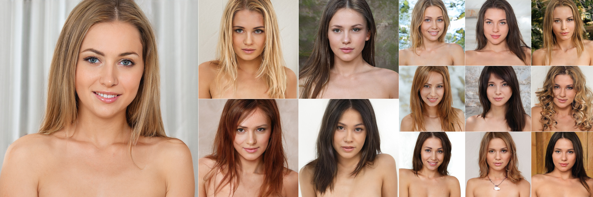

## Scaling up StyleGAN2

<!-- git title: Achieving photorealistic quality by scaling up StyleGAN2. -->

<p align="right">
<i>For the love of god will someone research something besides faces.
<br>— dvs</i></p>
</p>

<b>
Disclaimer: I might be completely wrong about anything expressed below. I haven't performed proper ablation studies due to limited compute. This writeup is overfit to a single dataset. Neither me nor this repo is associated in any way with NVidia.
</b>

## TL;DR
This write-up is a continuation of my previous one, ["Practical aspects of StyleGAN2 training"](https://github.com/l4rz/practical-aspects-of-stylegan2-training).

I have trained StyleGAN2 ("SG2") from scratch with a dataset of female portraits at 1024px resolution. The samples quality was further improved by scaling the number of trainable parameters up by ~200%, allowing to achieve better FID50K metrics as well as close to photorealistic samples quality.


*Curated samples, XXL and XL models, sampled with Ψ=0.60*

## Table of Contents
1. [Background](#background)<br>
2. [Dataset improvements](#dataset)<br>
3. [Larger models](#models)<br>
  3.1. [The M model](#model-m)<br>
  3.2. [The L model](#model-l)<br>
  3.3. [The XL and XXL models](#models-xl-xxl)<br>
4. [Conclusion](#conclusion)<br>


A. [Dataset enhancement techniques](#techniques)<br>
B. [Negative results](#negatives)<br>
C. [Some ideas to explore](#speculations)<br>


## Background<a name="background"></a>

The subjective quality of samples obtained in [previous experiments involving traingng SG2 from scratch with a dataset of female portraits at 1024px resolution](https://github.com/l4rz/practical-aspects-of-stylegan2-training) left a lot of room for improvement. Even with good FID50K metrics (3.24 with 1024px `config-f` achieved on a dataset of N=36K portraits, `TF36K`), the contour lines of facial features were rather fuzzy and samples in general lacked the same degree of detail present in training set. I therefore decided to focus on samples quality.

## Dataset improvements<a name="dataset"></a>

Having come to the conclusion that the perfect alignment of `FFHQ` dataset was a significant contributing factor to the impressive results of SG2 demonstrated in the paper, I have opted to go for a more curated dataset too. There were still significant variations in poses in the `TF36K` dataset used in my previous experiments, e.g. with one shoulder rotated toward the camera, tilted heads, etc. These variations reduced the effective size of dataset, technically making it multi-class while the goal was to have 36K images of just one image class.

Therefore the first step was to concentrate much more on tweaking the dataset. [A previously trained pose detection classifier](https://github.com/l4rz/practical-aspects-of-stylegan2-training#dataset) was used for cropping and [MTCNN](https://github.com/ipazc/mtcnn) to detect facial features positions and discard photos with rotated or tilted heads. [BRISQUE](https://github.com/bukalapak/pybrisque) scoring was used to automate blurry images filtering. Finally, manual sorting was performed to remove outlying images of poorer quality and/or composition; images were scaled to 1024x1024 resolution, resulting in the `TFHQ36K` dataset with N=36K frontal (*en face*) portraits. More on this below in [Dataset enhancement techniques](#techniques).

## Larger models<a name="models"></a>

All training runs were performed on 4x Tesla V100 GPUs (32Gb VRAM). With release of consumer Ampere GPUs, it is perfectly possible to train high capacity networks with the same minibatch sizes on consumer hardware. RTX 3090 slightly (~25%) outperforms a Tesla V100 on SG2 training tasks. The speedup is less than one can expect taking into account the almost doubled TFLOPs performance of GA102 graphics chip compared to GV100; RTX 3090 is capped by memory speed. Mixed precision training provides further speedup. Training of the largest model mentioned, `XXL`, should take around four weeks on a single RTX 3090 to reach good results (FID50K=3.00 around 5000k img).

The models configurations are summarized below.

| Model name    | 64px fmaps | 128px fmaps | 256px fmaps | 512px fmaps | 1024px fmaps | total parameters
| ------------- |:-------------:| -----:|-----:|-----:|-----:|-----:|
| config-f | 512 | 256 | 128 | 64 | 32 | 59K |
| M | 512 | 384 | 192 | 96 | 48 | 64K |
| L | 512 | 512 | 256 | 128 | 64 | 70K |
| XL | 640 | 640 | 320 | 160 | 80 | 106K |
| XXL | 768 | 768 | 384 | 192 | 96 | 150K |

<b>NOTE:</b> feature map counts in the lowest-resolution layers (32px and lower) are equal to 64px feature map count.

### The M model<a name="model-m"></a>

For the `M` model, I simply increased `fmap_base` parameter that controls the number of feature maps in higher resolution layers. (To double feature map counts in all layers, one needs to increase `fmap_max` parameter as well). Setting `fmap_base = 24576` makes a network with feature map count of 48 in 1024px layers, 96 in 512px, 192 in 256px, 384 in 128px and 512 in 64px and lower resolution layers. The resulting network contains 64K parameters vs 59K in `config-f` and is approximately 1.6 times slower in training (with 4x Tesla V100 GPUs, it trains at 106 seconds per a thousand of images ("kimg") versus 65 seconds per kimg for a 1024px `config-f`).

The initial learning rate was set to 1 × 10<sup>-3</sup>, decreasing to 1 × 10<sup>-4</sup> after 10000 kimg and further to 1 × 10<sup>-5</sup> after 20000 kimg. Mirror augmentation was enabled in all experiments and R1 regularization
weight γ (`d_loss.gamma` hyperparameter) was set to 10 initially. At the final stage of training after 20000 kimg γ was decayed to 5 and also I found it beneficial to set `D_lrate` to twice the value of `G_lrate`.

Compared to `config-f`, I've experienced quite a lot of collapses while training the `M` model. This is consistent with the earlier observations that as networks become larger, more instability occurs. As it was pointed out by [Karras et al](https://arxiv.org/abs/2006.06676) and [Brock et al](https://arxiv.org/abs/1809.11096), these instabilities arise likely due to the overfitting of D and the subsequent inability of D to provide meaningful gradients to G. Therefore the obvious solution to avoid (or delay) the collapse is to increase the dataset size, however it was something that I'd prefer to avoid. Several methods have been investigated to alleviate the problem of collapse:

__Regularization and learning rate__ Decreasing the LR helps to a certain degree but significantly slows down the convergence. I found it more beneficial, performance-wise, to avoid decreasing the LR as long as possible, applying more aggressive R1 regularization by increasing the `d_loss.gamma` at first and then tapering it off.

__Noconst__ It was proposed that the fact that the initial block of G network of SG2 is a learned constant, not dependent of the embedding, actually limits its capabilities at pose modeling and making the 4x4 block in the G network conditional on *W* latent (sort of return to the original GAN concept by [Goodfellow et al](https://arxiv.org/abs/1406.2661)) might improve its performance. Aydao implemented it by changing the code for the 4x4 block in `G_synthesis_stylegan2`:

```
# Early layers.
y = None
with tf.variable_scope('4x4'):
    #with tf.variable_scope('Const'):
    #    x = tf.get_variable('const', shape=[1, nf(1), 4, 4], initializer=tf.initializers.random_normal(), use_resource=True)
    #    x = tf.tile(tf.cast(x, dtype), [tf.shape(dlatents_in)[0], 1, 1, 1])
    with tf.variable_scope('Dense0'):
        x = apply_bias_act(dense_layer(dlatents_in[:, 0], fmaps=nf(0)*4), act=act)
        x = tf.reshape(x, [-1, nf(0), 2, 2])
    with tf.variable_scope('Conv0_up'):
        x = layer(x, layer_idx=0, fmaps=nf(0), kernel=3, up=True)
    with tf.variable_scope('Conv'):
        x = layer(x, layer_idx=0, fmaps=nf(1), kernel=3)
    if architecture == 'skip':
        y = torgb(x, y, 2)
```

I hot-swapped this block into a pre-trained model by copying the weights from a snapshot of pre-trained `M` model to a snapshot of freshly initialized `noconst` `M` model using [Aydao's `copy_weights_portable.py` script](https://github.com/aydao/stylegan2-surgery), then continuing training while freezing the higher resolution layers (from 16x16 block) with the gradual unfreezing. The model recovered within 1000 or 2000 kimg.

Freezing was achieved by modifying the list of trainables in `dnnlib/tflib/network.py`:
```
self.trainables = OrderedDict((name, var) for name, var \
in self.vars.items() if var.trainable \
and not 'G_mapping' in name \
and not '4x4' in name and not '8x8' in name \
and not '16x16' in name and not '32x32' in name \
and not '64x64' in name and not '128x128' in name \
and not '256x256' in name)
```

`Noconst` helped to stabilize training; in fact, in order to make progress with `noconst` I had to significantly, by the order of magnitude or so, increase the LR and it didn't resulted in collapse. However `noconst` didn't provided any substantial quality improvements. It could be that it was just too late, since `noconst` was introduced to an already pre-trained model. Due to compute constraints I didn't tried `noconst` while training from scratch.

__Augmentations__  Sid has implemented real+fake data augmentations from [Zhao et al "Differentiable Augmentation for Data-Efficient GAN Training" paper](https://arxiv.org/abs/2006.10738). I used [his code](https://github.com/sdtblck/stylegan2/tree/rfaugment_tpu) and it also helped to mitigate collapse to some degree, though not solving it completely.

(For more on real+fake data augmentations, please refer to [Gwern's comments](https://github.com/tensorfork/tensorfork/issues/35).)

The `M` model was trained to 30000 kimg. The improvements in structure, such as more pronounced corners borders of facial features, were there but overall the improvement was rather marginal over `config-f`.


*Curated samples. Series A: config-f; Series B: the M model. Sampled with Ψ=0.60*


*Zoomed in samples of the M model, demonstrating severe asymmetry of features*

Probably due to insufficient capacity capacity, and also as a consequence of changing the hyperparameters during the training, the `M` model has suffered from severe mode dropping.  Samples generated with lower Ψ values (less than 0.50) demonstrated lack of diversity, while using higher Ψ values led to quick deterioration of features. Having achieved FID50K score slightly lower than 4.00, I decided to abandon this model and move further.

A lesson learned from this run was that learning rates less than 1 × 10<sup>-4</sup> are of not much use for SG2 training. If the training collapses, something is wrong: either the dataset is too noisy, too complex, regularization strength is not enough or model's capacity is not sufficient. The model should be able to make progress while training with LR values not less than 1 × 10<sup>-4</sup>.

### The L model<a name="model-l"></a>

Thinking about how the quality can be further improved, I realized that the important factor contributing to the amazing results of SG2 with the `FFHQ` dataset was, among other things, the fact that the faces were zoomed in, taking 70-90% of the picture. With this degree of zoom, the details that contribute the most to the perceived high quality of the results manifest themselves in 128px and 256px layers, where feature map counts in `config-f` are 256 and 128 respectively.


*As demonstrated in [Karras et al SG2 paper](https://arxiv.org/abs/1912.04958)*

However with my `TFHQ36K` dataset where faces cover less than 50% of the picture these features are supposedly pushed to higher resolution layers (512px and 1024px), where the capacity is obviously not sufficient. with my dataset where faces cover less than 50 percent of the picture. This means that the number of feature maps in 512px and 1024px layers has to be further increased.

Therefore I decided to increase feature map counts in the `L` model to 64 in 1024px layers, 128 in 512px, 256 in 256px, 512 in 128px and lower resolution layers. For the simplicity and avoidance of doubt I specified it explicitly in the code of `training/networks.py`:
```
#def nf(stage): return np.clip(int(fmap_base / (2.0 ** (stage * fmap_decay))), fmap_min, fmap_max)
def nf(stage):
    bnf = np.clip(int(fmap_base / (2.0 ** (stage * fmap_decay))), fmap_min, fmap_max)
    if stage < 7: bnf = 512 # 128 and less
    if stage == 7: bnf = 256 # 256
    if stage == 8: bnf = 128 # 512
    if stage == 9: bnf = 64 # 1024
    print('fmap count', bnf, 'at stage', stage)
    return bnf
```

I opted to cap the feature map counts at 512 to strike a balance between increasing capacity and training computational cost. This configuration resulted in 70K parameters network (vs 59K in `config-f` at 1024px).

As StyleGAN2-ADA ("SG2-ADA") code was released soon after I started the `L` model training run, I decided to switch to SG2-ADA to take advantage of ADA augmentations and mixed FP16/FP32 precision. Mixed precision training led to significant speedup, 100 seconds per kimg versus 135 seconds per kimg for FP32 with 4x Tesla V100 GPUs.

(If you're experiencing issues with SG2-ADA on RTX 3000 series, please check [this issue open in the official repo](
https://github.com/NVlabs/stylegan2-ada/issues/32))

___Note on mixed precision training___ With SG2-ADA, mixed precision training works by casting some of parameters to FP16 before evaluating. It controlled by `args.G_args.num_fp16_res` and `args.D_args.num_fp16_res` values in `train.py`. For instance, `num_fp16_res = 4` means that FP16 precision is applied to the 4 highest resolutions layers. I observed that the default value of 4 is generally fine though in most cases it can be increased to 5 to conserve GPU memory and use larger minibatches. Higher values sometimes destabilize the training and make it is impossible to train from scratch with rather complex datasets. In this case the `num_fp16_res` value should be kept low initially and then increased later; trainable parameters are stored in PKL with full FP32 precision. I failed to notice the effect of reasonable `num_fp16_res` values on FID50K scores and subjective quality of samples.

For ADA run I haven't used the `auto` config option. The initial learning rate was set to 2 × 10<sup>-3</sup>, later decreased to 2 × 10<sup>-4</sup> after 10000 kimg and further to 1 × 10<sup>-4</sup> after 20000 kimg.  Stock settings were used for augmentation parameters; R1 regularization weight γ was set to 5.

Mixing regularization was turned off completely by setting `args.G_args.style_mixing_prob` to `None`. I found it beneficial for the samples quality. The point of mixing regularization is to improve network robustness for scenarios where multiple latents are mixed during sample generation; but it provides little improvement, not making things worse at best, for a standard single latent sampling scenario.

Compared to vanilla SG2, training with SG2-ADA is incredibly stable. The larger capacity of the `L` model allowed it achieve good samples quality quite soon. At 10000 kimg FID50K reached 3.00 and the final FID50K after 25000 kimg was 2.32.


*Curated samples, the L model. Sampled with Ψ=0.60*

With this level of performance increase, I'm so much tempted to refer to SG2-ADA as *StyleGAN3*. It seemed that I was on the right track and scaling up alone worked quite well; therefore I decided to continue increasing network capacity without changing the architecture.

### XL and XXL models <a name="models-xl-xxl"></a>

Taking things a little bit further I decided to increase the capacity of the `L` model even more, constructing two configurations with feature map counts of 80 in 1024px layers, 160 in 512px, 320 in 256px, 640 in 128px and lower resolution layers in one case and 96, 192, 384, 768 respectively in another. This resulted in the `XL` model with 106K parameters, almost two times more compared to `config-f`, and in the `XXL` model with 150K parameters. Training also slowed down considerably to 135 seconds per kimg with mixed precision (`num_fp16_res = 4`) for the `XL` model.

Learning rate for both `XL` and `XXL` was set to 1.5 × 10<sup>-3</sup> initially, decreased in several steps to 1.5 × 10<sup>-4</sup> and kept at this value after 6000 kimg. Stock settings (`paper1024px` config) were used for augmentation parameters; R1 regularization weight γ was set to 6. As with the `L` model, mixing regularization was turned off.

I found γ values of 5..6 to be optimal for `TFHQ36K` dataset. Lowering γ below 5 leads to somewhat better FID50K scores (supposedly due to network starting to reproduce minor image artifacts) but samples start to demonstrate increased asymmetry.

It turned out that augmentations are quite beneficial even with a rather large `TFHQ36K` dataset. Without augmentations, the training collapses quite soon. Turning it off later leads to mode dropping. It could be due to the fact that despite being face-aligned  `TFHQ36K` is still more variant (more poses) compared to `FFHQ` dataset. Similarly, the `L` model, I observed no collapses during training of `XL` and `XXL` models. Compared to my previous attempts to train such a large network with increased feature maps counts also in lower resolution layers, the network achieved a reasonable samples quality much faster.

The XL model was trained for 15000 kimg, reaching FID50K of 2.50. The same FID50K was achieved by `XXL` model around 8000 kimg ([training log](trainlog.txt)). For the `XXL` model the best FID50K was 2.40 after 11000 kimg. (<b>Update</b>: FID50K reached 1.85 after 25000 kimg with learning rate set to 1.5 × 10<sup>-4</sup>, γ = 5 and `num_fp16_res = 5`.) If the correct hyperparameters have been chosen and the model does not diverge, it is useful to continue the training further after achieving a good FID50K. Samples get better subjectively, with starker features and better colors.


*Curated samples. Series A: the L model; Series B: the XL model. Series C: the XXL model. Sampled with Ψ=0.60*

Like the `L` model, `XL` and `XXL` demonstrate much better sample quality when compared to `config-f` and the `M` model. Eyes are comparably good in all three models as the `TFHQ36K` dataset was aligned using eye keypoints. However because during alignment other landmarks' (nose, mouth) keypoints were not used, the variation in locations of those is greater and lower capacity models struggle to grasp these finer structures. While most random samples generated by `L` and `XL` models display significantly distorted or blurred teeth, the correct structure and absence of characteristic artifacts such as uneven number of incisors are exhibited in almost all samples of `XXL` models.


*Cropped random samples. Series A: the L model; Series B: the XXL model. Sampled with Ψ=0.60*

Overall, the `XXL` model demonstrates great variety and better spatial and spectral composition of samples.


*Curated samples, the XXL model, Ψ=0.60*

It is also worth noting that `XL` and `XXL` models began to learn to correctly synthesize corneal specular highlights, indicating that starting from a certain network capacity irregularities in their composition will not work to detect GAN-generated faces.


*Cropped samples, the XXL model, Ψ=0.60*

## Conclusion<a name="conclusion"></a>

All of the above clearly demonstrates that SG2 trained on portraits significantly benefits from scaling up in terms of performance. The success of the `XXL` model demonstrates that adding capacity helps to achieve greater shift invariance, thus mitigating the effects of less than perfectly localized features in the training set.

It also suggest that the architecture of SG2, with skip connections in G and residual connections in D, can be scaled arbitrary, both to higher capacity and higher resolutions (e.g. 2048px), as training instability was mitigated to a great degree by ADA. One can start with the baseline `config-f` capacity. Should there be objects which quality details greatly affects overall perception of generated images, such as faces or arms/palms, feature map counts in higher resolution layers should be increased. Mixed precision training decreases compute and memory requirements for those layers. One also needs to pay attention to the capacity in lower resolution layers; increasing feature map counts quickly multiplies the total parameter count and compute requirements, as lower resolution layers require full precision. As soon as training samples start to demonstrate good composition and structure in 50 epochs or so, the model capacity can be considered sufficient.

Regularization settings should be adjusted for the particular training set. It should be noted that while comparing FID50K metric one should use the same dataset; lowering N count leads to better indicated FID50K metrics. At the end, visual perceptive quality, not metric is that matters the most.

__Acknowledgments__ I would like to thank Tero Karras et al; also Shawn, Gwern, Aydao, Sid and Louis for helpful input and my friend for providing the GPUs.

## A. Dataset enhancement thechniques<a name="techniques"></a>

__Filtering out blurry images__ BRISQUE (["No-Reference Image Quality Assessment in the Spatial Domain"](https://ieeexplore.ieee.org/document/6272356/), [code](https://github.com/bukalapak/pybrisque)) allows to remove blurry images by rejecting ones with BRISQUE score above a certain set value.

__Face alignment__  MTCNN detector returns a list of objects that contain not just the confidence value and bounding box matching a face (as TF OD detector I've employed previously), but also coordinates for landmark keypoints ('left_eye', 'right_eye', 'nose', 'mouth_left', 'mouth_right'). Images with severely rotated or tilted faces were discarded by comparing coordinates of eyes vs the face centerline.
```
from mtcnn import MTCNN
detector = MTCNN()

data = detector.detect_faces(cv.cvtColor(imq, cv.COLOR_BGR2RGB))

box = data[0]['box']
keypoints = data[0]['keypoints']

# first of all, eyes Y must be within certain % of face height
f_height = int(box[3]  / 0.3 )  # height in px
eye1_y = int(keypoints['left_eye'][1] / 0.3)
eye2_y = int(keypoints['right_eye'][1] / 0.3 )
eyes_y_delta = abs(eye1_y - eye2_y)
eyes_v_delta_percent = int( (eyes_y_delta / f_height) * 100)
# then, eyes X must be centerline-symmetric
eye1_x = int(keypoints['left_eye'][0] / 0.3)
eye2_x = int(keypoints['right_eye'][0] / 0.3 )
centerline_x = int(box[0] / 0.3 ) + int ( int(box[2] / 0.3 ) /2)
eye1_offset = centerline_x - eye1_x
eye2_offset = eye2_x - centerline_x
delta_offset = int(abs(eye1_offset - eye2_offset) / ((eye1_offset + eye2_offset) / 2) * 100)

if eyes_v_delta_percent < 10 and delta_offset < 90:
    # save image
```

Alternatively, one can use [pbaylies script](https://github.com/pbaylies/stylegan-encoder/blob/master/align_images.py) to align images based on facial landmarks.

__Pose homogenization (updated)__ Running [U-2-Net masks/silhouettes separation](https://github.com/NathanUA/U-2-Net), followed by comparing the histograms of two image halves (split by a vertical centerline) helped me to get rid of some really assymetric images.

```
# a modified u2net_test.py

def return_output(image_name,pred):
    predict = pred
    predict = predict.squeeze()
    predict_np = predict.cpu().data.numpy()
    im = Image.fromarray(predict_np*255).convert('RGB')
    img_name = image_name.split(os.sep)[-1]
    image = io.imread(image_name)
    imo = im.resize((image.shape[1],image.shape[0]),resample=Image.BILINEAR)
    return imo

...

for i_test, data_test in enumerate(test_salobj_dataloader):
    inputs_test = data_test['image']

inputs_test = inputs_test.type(torch.FloatTensor)

# run U-2-Net inference
if torch.cuda.is_available():
    inputs_test = Variable(inputs_test.cuda())
else:
    inputs_test = Variable(inputs_test)

d1,d2,d3,d4,d5,d6,d7= net(inputs_test)

# normalization
pred = d1[:,0,:,:]
pred = normPRED(pred)

imo = return_output(str(file),pred)
# pil to opencv
img = numpy.array(imo)
# RGB to BGR
img = img[:, :, ::-1].copy()

# now calculate the symmetry metric
width = img.shape[1]
width_cutoff = width // 2
s1 = img[:, :width_cutoff]
s2 = cv.flip(img[:, width_cutoff:],1)
G_Y1 = cv.reduce(s1, 1 ,cv.REDUCE_SUM,dtype=cv.CV_32F)
G_Y2 = cv.reduce(s2, 1 ,cv.REDUCE_SUM,dtype=cv.CV_32F)
metric = cv.compareHist(G_Y1 ,G_Y2 ,cv.HISTCMP_BHATTACHARYYA)

# you should run this with a couple of really symmetric
# and assymetric samples to check the metric value.
# then you should be able to find a cutoff threshold
if metric < 0.06:
    # save image
```

print(file,"score",compare_val)


I tried FID metrics on [U-2-Net separated masks/silhouettes](https://github.com/NathanUA/U-2-Net) too, this didn't worked for me as well.


I tried to use FID score (e.g. [pytorch-fid](https://github.com/mseitzer/pytorch-fid)) for accurate similarity measurement at a pose-wise level. It didn't worked; FID score doesn't have any sense of global structure and pays more attention to textures than to shapes.

## B. Negative results<a name="negatives"></a>

A couple of techniques were explored that ended up yielding worse results or not affecting performance.

__Less than uniform dataset__ Expanding dataset to include more images with tilted and rotated faces while keeping its' size N at the same order of magnitude significantly slowed down convergence and led to worse (i.e. blurry or malformed) samples, especially with lower-capacity models. Similar results were observed when the dataset was not sufficiently curated, containing 1-2% of unrelated images (e.g. body parts).

Compared to the lower capacity models, higher capacity ones seem to perform better when the training set is less than uniform, provided that N is scaled accordingly to number of classes, keeping number of images per class at least the same. Frontal, 3/4, and lateral face photos, or straight and tilted ones comprise different classes. The same applies to pose composition.

__Pose homogenization__ I tried to use FID score (e.g. [pytorch-fid](https://github.com/mseitzer/pytorch-fid)) for accurate similarity measurement at a pose-wise level. It didn't worked; FID score doesn't have any sense of global structure and pays more attention to textures than to shapes.

__Pose separation by using FID on segmented images__ I tried FID metrics on [U-2-Net separated masks/silhouettes](https://github.com/NathanUA/U-2-Net) too, this didn't worked for me as well.

__Sharpening training set images__ I've also attempted to sharpen the images ([code](https://gist.github.com/soroushj/1217c523f6fe3cd3eccfd67337007e02))
```
import cv2 as cv
import numpy as np

def unsharp_mask(image, kernel_size=(5, 5), sigma=1.0, amount=1.0, threshold=0):
    """Return a sharpened version of the image, using an unsharp mask."""
    blurred = cv.GaussianBlur(image, kernel_size, sigma)
    sharpened = float(amount + 1) * image - float(amount) * blurred
    sharpened = np.maximum(sharpened, np.zeros(sharpened.shape))
    sharpened = np.minimum(sharpened, 255 * np.ones(sharpened.shape))
    sharpened = sharpened.round().astype(np.uint8)
    if threshold > 0:
        low_contrast_mask = np.absolute(image - blurred) < threshold
        np.copyto(sharpened, image, where=low_contrast_mask)
    return sharpened
```
In practice this lead to SG2 memorizing sharpening artifacts and in turn to significantly better but uncorrelated with the samples quality FID50K scores.

__Using videos to augment the training set__ Augmenting the `TFHQ36K` dataset with frames from 4K videos (extracted with my pre-trained TF OD detector) didn't worked well. Training set quality was reduced since the video frames are usually somewhat blurred and the dynamic range is inferior compared to photos.

__Asymmetric D/G capacity__ I tried doubling the capacity of some layers in G network only. This crippled training, likely due to insufficient ability of D to provide useful gradients to G.


*Early training samples (2000 kimg). Series A: config-f with doubled feature map counts in 256, 512, 1024px layers of D and G networks. Series B: doubled feature map counts only in G network. Sampled with Ψ=0.50*

__Increasing mapping layers to 12__ Did not notice any benefits; in fact, the mapping network can be made even shallower, as it was mentioned in [SG2-ADA paper](https://arxiv.org/abs/2006.06676).

## C. Some ideas to explore<a name="speculations"></a>

__Enhancing training set images__
Enhancing training set images with modern super-resolution techniques can lead to better performance and allow to use frames extracted from videos as well. Care should be used while choosing the technique, as there is still no domain-independent image enhancer, to the best of my knowledge. Even the decent ones such as Remini give good results with faces but tend to blur other objects.

__Augmentations ops with higher resolution images__
It is mentioned in [SG2-ADA paper](https://arxiv.org/abs/2006.06676) that authors specifically focused on reducing the loss of high-frequency details during geometric transformations in augmentations. While neither [Karras et al](https://arxiv.org/abs/2006.06676), nor [Zhao (b) et al](https://arxiv.org/abs/2006.10738) use zoom as an operation in their augs pipeline, [Zhao (a) et al "Image Augmentations for GAN Training" paper](https://arxiv.org/abs/2006.02595) use zoomins and zoomouts with bilinear interpolation. Taking into account the tendency of SG2 to memorize image artifacts, there is concern that these operations might compromise the samples quality. Since most images in the 1024px training set are actually downscaled from the originals of the higher resolution, it would be interesting to implement and test the zoomin augmentation operation that returns a fragment of the original higher resolution image. This could help to preserve the finer details.

## Written by

[l4rz](https://twitter.com/l4rz)
